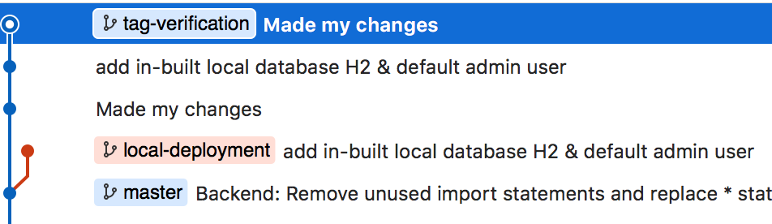
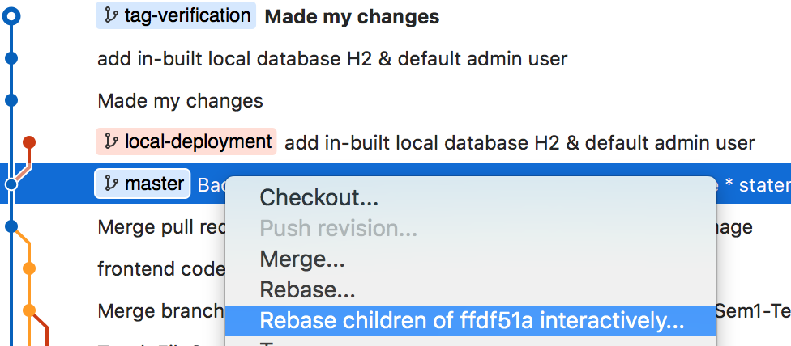
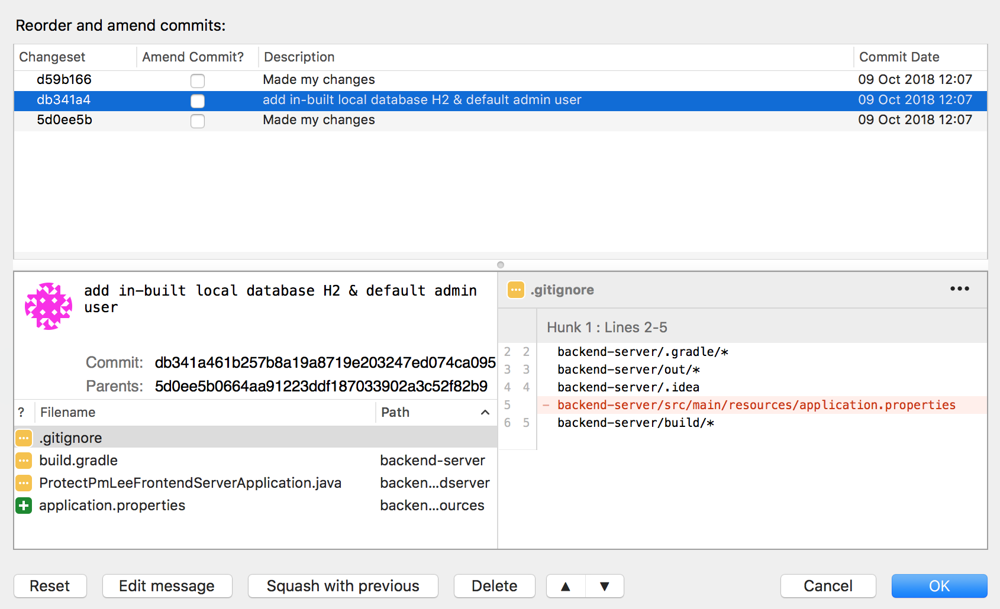

# protect-PM-Lee-frontend
Learning to be good Info-Sec students to protect PM Lee's data

## Cygwin

## Developer Guide

For deployment on local host (perhaps, for testing purposes), go to `local-deployment` branch. This branch uses H2 database (instead of MySQL) which is in-built and doesn't require additional configuration, whereas MySQL database on `master` branch requires an additional step of setting up a local MySQL database. 

Simply **cherry-pick** this commit on top of the branch. Alternatively, you can branch off from `local-deployment` branch instead of `master` branch.

After you're done with the changes that you've made, perform the following steps on Sourcetree to remove this commit from your PR (you shouldn't merge the H2 database configurations into master branch).

1. Suppose you're on branch `tag-verification`.

1. Right-click `master` and select the interactive rebase option.

1. Click on the commit to be deleted and click on `Delete` and `Ok`.

1. Perform a force push and you're good to go. 

### Frontend
To run the front-end, go to 'healthcare-app-client' and run:
1. `yarn install`
1. `yarn start`

### Backend
To run the server, go to the backend directory and run `gradlew.bat bootRun` (or `./gradlew bootRun` for Mac/Linux).
